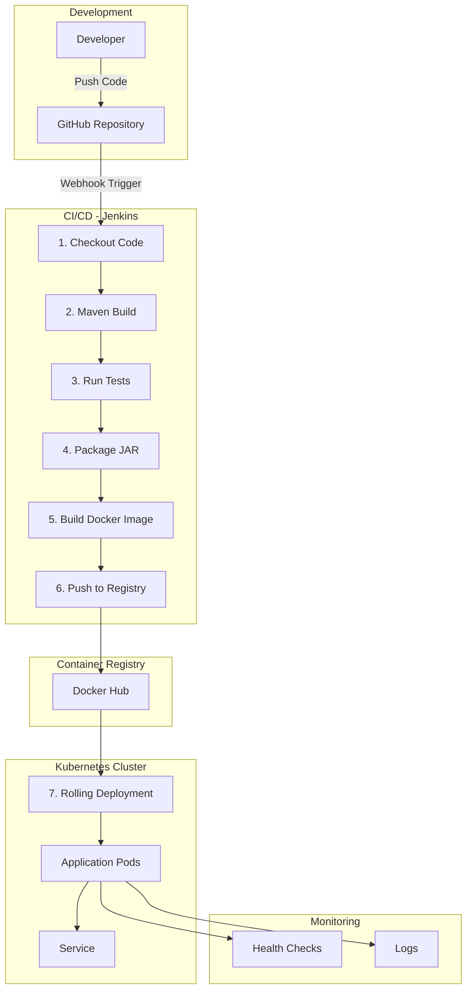
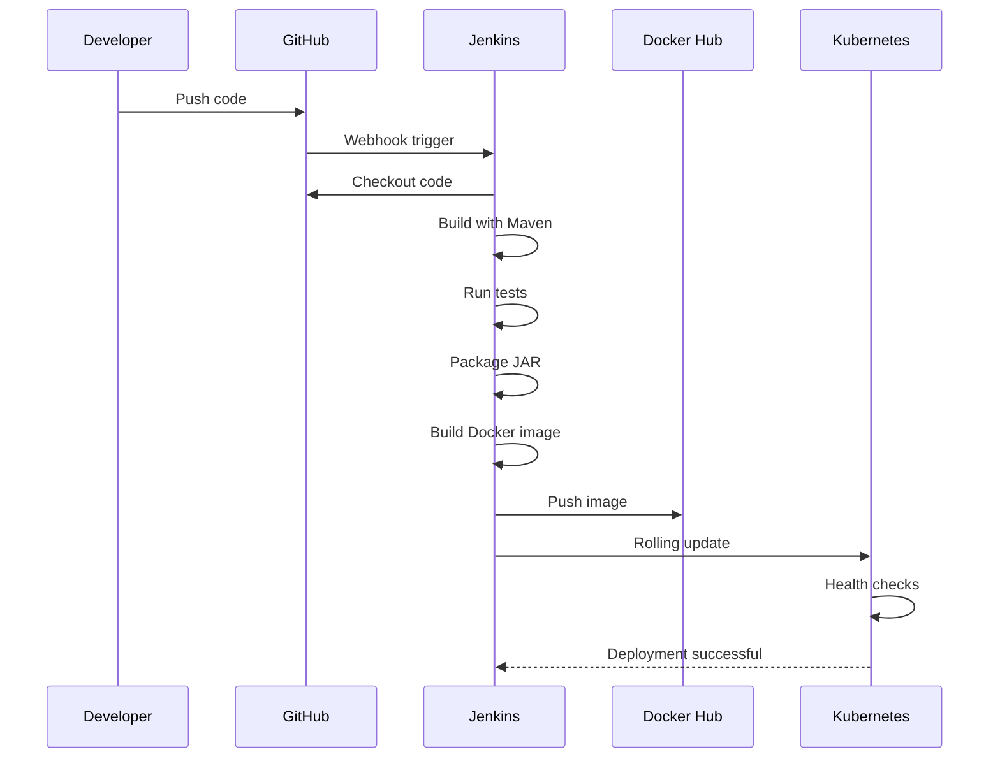

# DevOps CI/CD Pipeline - Java Application

    

A complete CI/CD pipeline implementation for a Java-based Spring Boot application using Jenkins, Docker, and Kubernetes. This project demonstrates modern DevOps practices including automated builds, testing, containerization, and zero-downtime deployments.

## GitHub Actions CI/CD (added)

A GitHub Actions workflow (`.github/workflows/ci-cd.yml`) has been added to perform the full pipeline:

- Build and run Maven tests
- Build and push Docker image to Docker Hub
- Deploy to Kubernetes cluster and perform a rolling update

Required GitHub repository secrets:

- `DOCKERHUB_USERNAME` — your Docker Hub username (e.g., Shaan098)
- `DOCKERHUB_TOKEN` — Docker Hub access token or password
- `KUBE_CONFIG` — base64-encoded Kubernetes `kubeconfig` file for the target cluster

How it works:

1. Push to `main` triggers the workflow.
2. Maven build and tests run.
3. Docker image is built and pushed with tags `latest` and a run-specific tag.
4. Workflow decodes `KUBE_CONFIG`, applies namespace/configmap/service, and updates the deployment image.

If you prefer to run locally instead of using GitHub Actions, install Docker Desktop and follow the commands below.

## 📋 Table of Contents

- [Overview](#overview)
- [Architecture](#architecture)
- [Features](#features)
- [Technology Stack](#technology-stack)
- [Prerequisites](#prerequisites)
- [Quick Start](#quick-start)
- [Project Structure](#project-structure)
- [CI/CD Pipeline](#cicd-pipeline)
- [Deployment](#deployment)
- [Testing](#testing)
- [Troubleshooting](#troubleshooting)
- [Contributing](#contributing)

## 🎯 Overview

Traditional software development involves manual build and deployment processes that are time-consuming, error-prone, and lead to application downtime. This project solves these challenges by implementing a fully automated CI/CD pipeline that:

- **Automates** the entire software delivery process
- **Reduces** manual intervention and deployment errors
- **Improves** release speed and reliability
- **Ensures** zero-downtime deployments with rolling updates
- **Provides** scalability and self-healing through Kubernetes

## 🏗️ Architecture



## ✨ Features

### Application Features

- ✅ RESTful API endpoints
- ✅ Health check endpoint for monitoring
- ✅ Application info endpoint
- ✅ Comprehensive unit tests
- ✅ Spring Boot Actuator integration

### DevOps Features

- ✅ Automated CI/CD pipeline with Jenkins
- ✅ Multi-stage Docker builds for optimization
- ✅ Kubernetes deployment with 3 replicas
- ✅ Rolling update strategy (zero downtime)
- ✅ Liveness and readiness probes
- ✅ Resource management (CPU/Memory limits)
- ✅ ConfigMap for externalized configuration
- ✅ Automated testing in pipeline
- ✅ Docker image versioning with build numbers

## 🛠️ Technology Stack

| Component              | Technology                  | Purpose                            |
| ---------------------- | --------------------------- | ---------------------------------- |
| **Application**        | Java 17 + Spring Boot 3.2.0 | Backend application framework      |
| **Build Tool**         | Maven                       | Dependency management and building |
| **Containerization**   | Docker                      | Application containerization       |
| **Orchestration**      | Kubernetes (Minikube)       | Container orchestration            |
| **CI/CD**              | Jenkins                     | Automation server                  |
| **Version Control**    | Git/GitHub                  | Source code management             |
| **Container Registry** | Docker Hub                  | Docker image storage               |
| **Testing**            | JUnit + Spring Test         | Unit testing                       |

## 📦 Prerequisites

Before you begin, ensure you have the following installed:

### Required Software

- **Java Development Kit (JDK) 17+**

  ```powershell
  java -version
  ```

- **Maven 3.6+**

  ```powershell
  mvn -version
  ```

- **Docker Desktop**

  ```powershell
  docker --version
  ```

- **Minikube**

  ```powershell
  minikube version
  ```

- **kubectl**

  ```powershell
  kubectl version --client
  ```

- **Jenkins** (Local or Docker)

  - See [docs/SETUP.md](docs/SETUP.md) for installation instructions

- **Git**
  ```powershell
  git --version
  ```

### Accounts Required

- GitHub account (for version control)
- Docker Hub account (for image registry)

## 🚀 Quick Start

### 1. Clone the Repository

```powershell
git clone <your-repo-url>
cd "DEVOPS PROJECT"
```

### 2. Build the Application Locally

```powershell
# Compile and build
mvn clean package

# Run tests
mvn test

# Run locally
mvn spring-boot:run
```

Access the application at:

- Health: http://localhost:8080/health
- API Info: http://localhost:8080/api/info
- Welcome: http://localhost:8080/

### 3. Build and Run Docker Container

```powershell
# Build Docker image
docker build -t devops-demo:1.0 .

# Run container
docker run -p 8080:8080 devops-demo:1.0

# Test health endpoint
Invoke-WebRequest -Uri http://localhost:8080/health
```

### 4. Deploy to Kubernetes (Minikube)

```powershell
# Start Minikube
minikube start

# Apply Kubernetes manifests
kubectl apply -f k8s/namespace.yaml
kubectl apply -f k8s/configmap.yaml
kubectl apply -f k8s/deployment.yaml
kubectl apply -f k8s/service.yaml

# Check deployment status
kubectl get pods -n devops-demo
kubectl get svc -n devops-demo

# Access the application
minikube service devops-demo-service -n devops-demo
```

### 5. Set Up Jenkins Pipeline

See [docs/SETUP.md](docs/SETUP.md) for detailed Jenkins configuration instructions.

## 📁 Project Structure

```
DEVOPS PROJECT/
├── src/
│   ├── main/
│   │   ├── java/com/devops/demo/
│   │   │   ├── DemoApplication.java          # Main application class
│   │   │   ├── controller/
│   │   │   │   └── HealthController.java     # REST endpoints
│   │   │   └── model/
│   │   │       └── AppInfo.java              # Data model
│   │   └── resources/
│   │       ├── application.properties        # App configuration
│   │       └── banner.txt                    # Custom banner
│   └── test/
│       └── java/com/devops/demo/
│           └── HealthControllerTest.java     # Unit tests
├── k8s/
│   ├── namespace.yaml                        # Kubernetes namespace
│   ├── configmap.yaml                        # Configuration
│   ├── deployment.yaml                       # Deployment manifest
│   └── service.yaml                          # Service manifest
├── docs/
│   ├── SETUP.md                              # Setup guide
│   ├── PIPELINE.md                           # Pipeline documentation
│   └── ARCHITECTURE.md                       # Architecture details
├── Dockerfile                                # Multi-stage Docker build
├── .dockerignore                             # Docker ignore patterns
├── Jenkinsfile                               # Jenkins pipeline
├── pom.xml                                   # Maven configuration
├── .gitignore                                # Git ignore patterns
└── README.md                                 # This file
```

## 🔄 CI/CD Pipeline

The Jenkins pipeline automates the following stages:

### Pipeline Stages

1. **Checkout** - Pulls latest code from GitHub
2. **Build** - Compiles Java source code with Maven
3. **Test** - Runs unit tests and generates reports
4. **Package** - Creates executable JAR file
5. **Build Docker Image** - Creates Docker image with version tag
6. **Push Docker Image** - Pushes image to Docker Hub
7. **Deploy to Kubernetes** - Performs rolling update deployment
8. **Verify Deployment** - Checks deployment status and pod health

### Pipeline Workflow



### Zero-Downtime Deployment

The pipeline implements a **rolling update strategy**:

- `maxSurge: 1` - One extra pod created during update
- `maxUnavailable: 0` - All pods remain available during update
- Health probes ensure only healthy pods receive traffic

## 🚢 Deployment

### Manual Deployment to Kubernetes

```powershell
# Update deployment image
kubectl set image deployment/devops-demo-deployment `
    devops-demo=your-dockerhub-username/devops-demo:1.0 `
    -n devops-demo --record

# Check rollout status
kubectl rollout status deployment/devops-demo-deployment -n devops-demo

# View pods
kubectl get pods -n devops-demo -w

# View logs
kubectl logs -f deployment/devops-demo-deployment -n devops-demo
```

### Rollback Deployment

```powershell
# View rollout history
kubectl rollout history deployment/devops-demo-deployment -n devops-demo

# Rollback to previous version
kubectl rollout undo deployment/devops-demo-deployment -n devops-demo

# Rollback to specific revision
kubectl rollout undo deployment/devops-demo-deployment -n devops-demo --to-revision=2
```

## 🧪 Testing

### Run Unit Tests

```powershell
mvn test
```

### Run Integration Tests

```powershell
mvn verify
```

### Test Endpoints

```powershell
# Health check
Invoke-WebRequest -Uri http://localhost:8080/health

# Application info
Invoke-WebRequest -Uri http://localhost:8080/api/info

# Welcome page
Invoke-WebRequest -Uri http://localhost:8080/
```

## 🔧 Troubleshooting

### Common Issues

#### Build Fails

```powershell
# Clean and rebuild
mvn clean install -U

# Skip tests if needed
mvn clean package -DskipTests
```

#### Docker Build Fails

```powershell
# Check Docker is running
docker ps

# Clean Docker cache
docker system prune -a
```

#### Kubernetes Pod Not Starting

```powershell
# Check pod status
kubectl describe pod <pod-name> -n devops-demo

# View logs
kubectl logs <pod-name> -n devops-demo

# Check events
kubectl get events -n devops-demo --sort-by='.lastTimestamp'
```

#### Jenkins Pipeline Fails

- Verify Jenkins plugins are installed (Git, Docker, Kubernetes)
- Check credentials are configured correctly
- Ensure kubectl is accessible from Jenkins
- Verify Docker daemon is running

### Logs and Monitoring

```powershell
# Application logs
kubectl logs -f deployment/devops-demo-deployment -n devops-demo

# All pods logs
kubectl logs -l app=devops-demo -n devops-demo --all-containers=true

# Pod events
kubectl get events -n devops-demo
```

## 📚 Additional Documentation

- [Setup Guide](docs/SETUP.md) - Detailed installation and configuration
- [Pipeline Documentation](docs/PIPELINE.md) - Pipeline architecture and customization
- [Architecture Guide](docs/ARCHITECTURE.md) - System design and best practices

## 🤝 Contributing

Contributions are welcome! Please follow these steps:

1. Fork the repository
2. Create a feature branch (`git checkout -b feature/AmazingFeature`)
3. Commit your changes (`git commit -m 'Add some AmazingFeature'`)
4. Push to the branch (`git push origin feature/AmazingFeature`)
5. Open a Pull Request

## 📝 License

This project is created for educational purposes to demonstrate CI/CD pipeline implementation.

## 👥 Authors

DevOps Team - CI/CD Pipeline Implementation

## 🙏 Acknowledgments

- Spring Boot community
- Jenkins community
- Kubernetes community
- Docker community

---

**Note**: This is a demonstration project. For production use, consider adding:

- SSL/TLS certificates
- Secret management (e.g., Vault)
- Enhanced monitoring (Prometheus/Grafana)
- Log aggregation (ELK Stack)
- Security scanning (SonarQube)
- Performance testing (JMeter)
