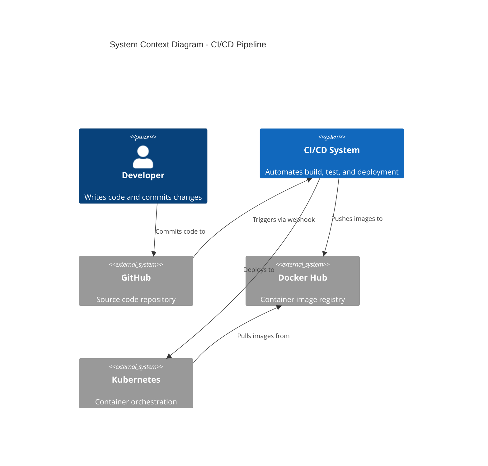
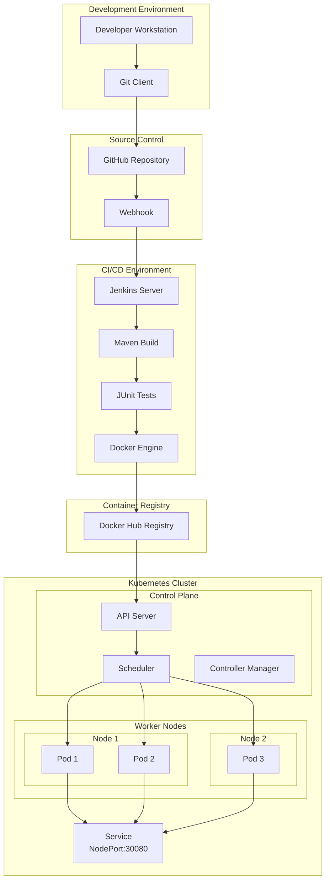
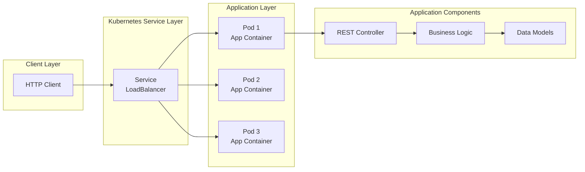
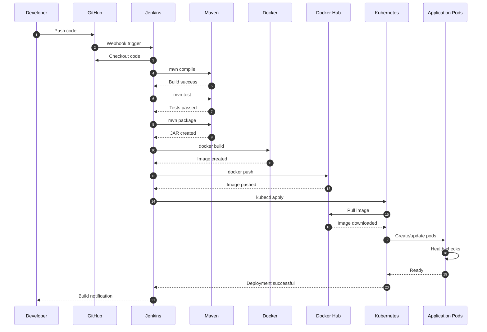
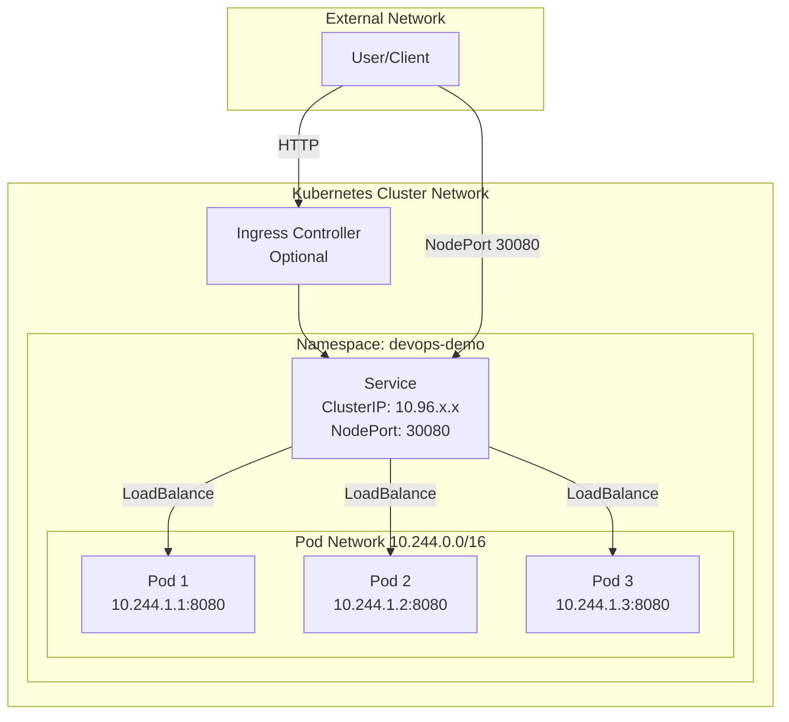

# Architecture Documentation

Technical architecture and design documentation for the DevOps CI/CD pipeline project.

## 📑 Table of Contents

1. [System Overview](#system-overview)
2. [Architecture Diagrams](#architecture-diagrams)
3. [Component Details](#component-details)
4. [Design Decisions](#design-decisions)
5. [Security Architecture](#security-architecture)
6. [Scalability and Performance](#scalability-and-performance)
7. [Disaster Recovery](#disaster-recovery)
8. [Future Enhancements](#future-enhancements)

---

## System Overview

The DevOps CI/CD pipeline implements a modern, cloud-native architecture that automates software delivery from code commit to production deployment.

### High-Level Architecture



### Technology Stack

| Layer | Technology | Version | Purpose |
|-------|-----------|---------|---------|
| **Application** | Java | 17 | Programming language |
| **Framework** | Spring Boot | 3.2.0 | Application framework |
| **Build** | Maven | 3.9+ | Dependency management |
| **CI/CD** | Jenkins | LTS | Automation server |
| **Containerization** | Docker | Latest | Container runtime |
| **Orchestration** | Kubernetes | 1.28+ | Container orchestration |
| **VCS** | Git/GitHub | - | Version control |
| **Registry** | Docker Hub | - | Image storage |

---

## Architecture Diagrams

### 1. Deployment Architecture



### 2. Application Architecture



### 3. CI/CD Pipeline Flow



### 4. Network Architecture



---

## Component Details

### 1. Application Layer

#### Spring Boot Application

**Components:**
- `DemoApplication.java` - Main application entry point
- `HealthController.java` - REST API endpoints
- `AppInfo.java` - Data transfer object

**Endpoints:**
- `GET /` - Welcome message
- `GET /health` - Health check (liveness probe)
- `GET /api/info` - Application information

**Configuration:**
- Port: 8080
- Profiles: `development`, `production`
- Logging: Console with INFO level

#### Dependencies

```xml
- spring-boot-starter-web (REST API)
- spring-boot-starter-actuator (Health checks)
- spring-boot-starter-test (Testing framework)
```

### 2. Build Layer

#### Maven Configuration

**Build Process:**
1. Dependency resolution
2. Compilation (`src/main/java`)
3. Test execution (`src/test/java`)
4. Packaging (JAR file)

**Optimization:**
- Dependency caching
- Incremental compilation
- Parallel test execution

### 3. Container Layer

#### Docker Multi-Stage Build

**Stage 1: Builder**
- Base: `maven:3.9-eclipse-temurin-17-alpine`
- Purpose: Compile and package application
- Output: `devops-demo.jar`

**Stage 2: Runtime**
- Base: `eclipse-temurin:17-jre-alpine`
- Purpose: Run application
- Size: ~200MB (optimized)

**Security:**
- Non-root user (`appuser`)
- Read-only filesystem
- Resource limits

**Health Check:**
- Interval: 30s
- Timeout: 3s
- Retries: 3
- Command: `wget http://localhost:8080/health`

### 4. Orchestration Layer

#### Kubernetes Resources

**Namespace:**
```yaml
Name: devops-demo
Labels: environment=production
```

**Deployment:**
```yaml
Replicas: 3
Strategy: RollingUpdate
  maxSurge: 1
  maxUnavailable: 0
Resources:
  requests: 256Mi RAM, 250m CPU
  limits: 512Mi RAM, 500m CPU
```

**Service:**
```yaml
Type: NodePort
Port: 8080 (cluster)
NodePort: 30080 (external)
Selector: app=devops-demo
```

**ConfigMap:**
```yaml
APP_VERSION: 1.0.0
APP_ENVIRONMENT: production
LOG_LEVEL: INFO
```

### 5. CI/CD Layer

#### Jenkins Pipeline

**Trigger Options:**
- GitHub webhook (automatic)
- SCM polling (scheduled)
- Manual trigger

**Stages:**
1. Checkout (10s)
2. Build (30s)
3. Test (20s)
4. Package (15s)
5. Docker Build (60s)
6. Docker Push (45s)
7. K8s Deploy (30s)
8. Verify (15s)

**Total Duration:** ~3-4 minutes

---

## Design Decisions

### 1. Why Spring Boot?

**Rationale:**
- ✅ Production-ready features (Actuator)
- ✅ Embedded server (no external Tomcat)
- ✅ Auto-configuration
- ✅ Extensive ecosystem

**Alternatives considered:**
- Quarkus (more complex setup)
- Micronaut (smaller community)

### 2. Why Multi-Stage Docker Build?

**Rationale:**
- ✅ Smaller image size (200MB vs 600MB+)
- ✅ Faster deployments
- ✅ Separation of build and runtime
- ✅ Security (no build tools in production)

**Results:**
- Build time: 3-5 minutes
- Image size: 195MB
- Attack surface: Minimal

### 3. Why Rolling Updates?

**Rationale:**
- ✅ Zero downtime deployments
- ✅ Gradual rollout
- ✅ Easy rollback
- ✅ Health validation before traffic

**Configuration:**
```yaml
maxSurge: 1        # +1 pod during update
maxUnavailable: 0  # Zero downtime
```

**Behavior:**
1. Create new pod
2. Wait for health checks
3. Route traffic to new pod
4. Terminate old pod
5. Repeat for remaining pods

### 4. Why 3 Replicas?

**Rationale:**
- ✅ High availability (2 failures tolerated)
- ✅ Load distribution
- ✅ Rolling update compatibility
- ✅ Resource efficiency

**Considerations:**
- Development: 1 replica (resource saving)
- Staging: 2 replicas (testing)
- Production: 3+ replicas (HA)

### 5. Why NodePort Service?

**Rationale:**
- ✅ Simple external access on Minikube
- ✅ No external load balancer required
- ✅ Suitable for development/testing

**Production alternative:**
- LoadBalancer service with cloud provider
- Ingress controller with TLS termination

---

## Security Architecture

### 1. Container Security

**Best Practices Implemented:**
- ✅ Non-root user in container
- ✅ Minimal base image (Alpine)
- ✅ No sensitive data in image
- ✅ Regular base image updates
- ✅ Health checks for auto-recovery

**Recommendations:**
- Image scanning (Trivy, Snyk)
- Signed images (Docker Content Trust)
- Private registry for production

### 2. Kubernetes Security

**Current Implementation:**
- ✅ Namespace isolation
- ✅ Resource limits (DoS prevention)
- ✅ Health probes
- ✅ ConfigMap for configuration

**Production Enhancements:**
- Network Policies (pod-to-pod rules)
- Pod Security Standards
- RBAC (Role-Based Access Control)
- Secrets for sensitive data
- Service mesh (mTLS)

### 3. CI/CD Security

**Implemented:**
- ✅ Credentials management in Jenkins
- ✅ No hardcoded secrets
- ✅ Separate build and deploy stages

**Enhancements:**
- Code quality gates (SonarQube)
- Dependency scanning (OWASP)
- Container image signing
- Audit logging

---

## Scalability and Performance

### 1. Horizontal Scaling

**Current Setup:**
- 3 replicas for high availability
- Load balancing via Kubernetes Service

**Auto-scaling (future):**
```yaml
apiVersion: autoscaling/v2
kind: HorizontalPodAutoscaler
metadata:
  name: devops-demo-hpa
spec:
  scaleTargetRef:
    apiVersion: apps/v1
    kind: Deployment
    name: devops-demo-deployment
  minReplicas: 3
  maxReplicas: 10
  metrics:
  - type: Resource
    resource:
      name: cpu
      target:
        type: Utilization
        averageUtilization: 70
```

### 2. Resource Optimization

**Request vs Limits:**
```yaml
requests:  # Guaranteed resources
  memory: 256Mi
  cpu: 250m
limits:    # Maximum allowed
  memory: 512Mi
  cpu: 500m
```

**Quality of Service:** Burstable class

### 3. Performance Metrics

**Target SLAs:**
- Application startup: < 60s
- API response time: < 200ms (p95)
- Deployment time: < 5 minutes
- Recovery time: < 30s

---

## Disaster Recovery

### 1. Backup Strategy

**Source Code:**
- Stored in GitHub (managed backups)
- Multiple developer clones

**Docker Images:**
- Tagged and versioned in Docker Hub
- Retention: Last 10 builds

**Kubernetes:**
- Manifest files in Git
- ConfigMap versioned

### 2. Recovery Procedures

**Application Failure:**
1. Kubernetes auto-restarts pod
2. Health probes detect failure
3. New pod created automatically

**Deployment Failure:**
```powershell
# Rollback to previous version
kubectl rollout undo deployment/devops-demo-deployment -n devops-demo
```

**Complete Cluster Failure:**
1. Spin up new Minikube/cluster
2. Apply manifests from Git
3. Deploy latest image from registry
4. Total recovery time: < 10 minutes

---

## Future Enhancements

### 1. Monitoring and Observability

**Prometheus + Grafana:**
- Metrics collection
- Dashboards and alerts
- Performance tracking

**ELK Stack:**
- Centralized logging
- Log analysis
- Error tracking

### 2. Advanced Deployment Strategies

**Blue-Green Deployment:**
- Zero-risk deployments
- Instant rollback
- A/B testing capability

**Canary Deployment:**
- Gradual traffic shift
- Risk mitigation
- Real-time validation

### 3. Security Enhancements

- **Vault:** Secrets management
- **Falco:** Runtime security
- **OPA:** Policy enforcement
- **Istio:** Service mesh with mTLS

### 4. Performance Optimization

- **Redis:** Caching layer
- **CDN:** Static content delivery
- **Database:** Persistent storage
- **Connection pooling:** Resource efficiency

### 5. Multi-Environment Support

```
- Development (local)
- Staging (cloud)
- Production (cloud)
- DR site (cloud)
```

---

## Architecture Review Checklist

- ✅ High availability (3 replicas)
- ✅ Zero downtime deployments (rolling updates)
- ✅ Auto-recovery (health probes, restartPolicy)
- ✅ Resource management (requests/limits)
- ✅ Security (non-root, isolation)
- ✅ Scalability (horizontal scaling ready)
- ✅ Observability (health endpoints)
- ✅ Version control (Git)
- ✅ Automation (Jenkins CI/CD)
- ✅ Documentation (comprehensive)

---

**Architecture Documentation Complete!** This architecture provides a solid foundation for modern cloud-native applications. 🏗️
