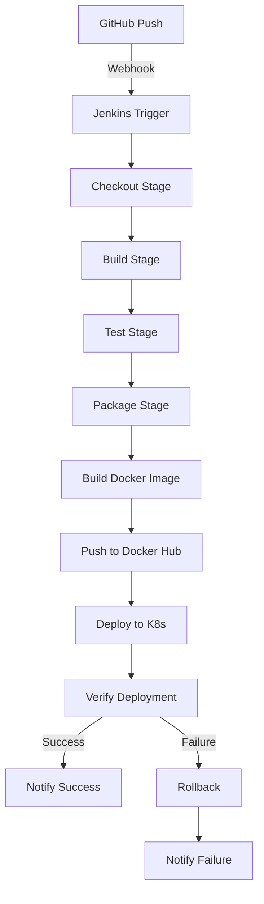

# CI/CD Pipeline Documentation

Comprehensive documentation for the Jenkins CI/CD pipeline implementation.

## 📑 Table of Contents

1. [Pipeline Overview](#pipeline-overview)
2. [Pipeline Architecture](#pipeline-architecture)
3. [Pipeline Stages](#pipeline-stages)
4. [Environment Variables](#environment-variables)
5. [Credentials Configuration](#credentials-configuration)
6. [Customization](#customization)
7. [Best Practices](#best-practices)
8. [Troubleshooting](#troubleshooting)

---

## Pipeline Overview

The Jenkins pipeline automates the complete software delivery process from code commit to production deployment. It implements a **declarative pipeline** approach using the `Jenkinsfile` stored in version control.

### Key Features

- ✅ Automated build on code push
- ✅ Parallel test execution
- ✅ Docker image versioning
- ✅ Zero-downtime Kubernetes deployment
- ✅ Automated rollback on failure
- ✅ Test result publishing
- ✅ Artifact archiving

---

## Pipeline Architecture



### Pipeline Flow

1. **Trigger**: GitHub webhook or SCM polling
2. **Checkout**: Pull latest code from repository
3. **Build**: Compile Java source code
4. **Test**: Run unit and integration tests
5. **Package**: Create executable JAR file
6. **Containerize**: Build Docker image
7. **Publish**: Push image to registry
8. **Deploy**: Rolling update to Kubernetes
9. **Verify**: Health checks and validation
10. **Notify**: Send status notifications

---

## Pipeline Stages

### 1. Checkout Stage

**Purpose**: Retrieve source code from GitHub repository

```groovy
stage('Checkout') {
    steps {
        checkout scm
        script {
            env.GIT_COMMIT_SHORT = sh(
                script: "git rev-parse --short HEAD",
                returnStdout: true
            ).trim()
        }
    }
}
```

**What it does:**
- Checks out code from the configured branch
- Retrieves Git commit hash for versioning
- Sets up workspace for subsequent stages

**Failure scenarios:**
- Repository not accessible
- Branch not found
- Authentication issues

---

### 2. Build Stage

**Purpose**: Compile Java source code using Maven

```groovy
stage('Build') {
    steps {
        sh 'mvn clean compile'
    }
}
```

**What it does:**
- Cleans previous build artifacts
- Downloads dependencies
- Compiles source code

**Output:**
- Compiled `.class` files in `target/classes/`

**Failure scenarios:**
- Compilation errors
- Missing dependencies
- Maven configuration issues

---

### 3. Test Stage

**Purpose**: Execute unit tests and generate reports

```groovy
stage('Test') {
    steps {
        sh 'mvn test'
    }
    post {
        always {
            junit '**/target/surefire-reports/*.xml'
        }
    }
}
```

**What it does:**
- Runs JUnit tests
- Generates test reports
- Publishes results to Jenkins

**Output:**
- Test reports in `target/surefire-reports/`
- Jenkins test result dashboard

**Failure scenarios:**
- Test failures
- Test code errors
- Missing test dependencies

---

### 4. Package Stage

**Purpose**: Create executable JAR file

```groovy
stage('Package') {
    steps {
        sh 'mvn package -DskipTests'
    }
    post {
        success {
            archiveArtifacts artifacts: '**/target/*.jar'
        }
    }
}
```

**What it does:**
- Packages compiled code into JAR
- Archives JAR in Jenkins
- Skips tests (already run)

**Output:**
- `target/devops-demo.jar`

**Failure scenarios:**
- Resource file issues
- Maven plugin errors

---

### 5. Build Docker Image Stage

**Purpose**: Create Docker container image

```groovy
stage('Build Docker Image') {
    steps {
        script {
            env.DOCKER_IMAGE_TAG = "${BUILD_NUMBER}-${env.GIT_COMMIT_SHORT}"
            sh """
                docker build -t ${DOCKER_IMAGE_NAME}:${DOCKER_IMAGE_TAG} .
                docker tag ${DOCKER_IMAGE_NAME}:${DOCKER_IMAGE_TAG} ${DOCKER_IMAGE_NAME}:latest
            """
        }
    }
}
```

**What it does:**
- Builds Docker image from Dockerfile
- Tags image with build number and commit hash
- Creates `latest` tag

**Image versioning:**
- Format: `{BUILD_NUMBER}-{GIT_COMMIT}`
- Example: `devops-demo:42-a1b2c3d`

**Failure scenarios:**
- Dockerfile syntax errors
- Docker daemon not running
- Build context issues

---

### 6. Push Docker Image Stage

**Purpose**: Upload image to Docker Hub

```groovy
stage('Push Docker Image') {
    steps {
        script {
            docker.withRegistry("https://${DOCKER_REGISTRY}", DOCKER_CREDENTIALS_ID) {
                sh """
                    docker push ${DOCKER_IMAGE_NAME}:${DOCKER_IMAGE_TAG}
                    docker push ${DOCKER_IMAGE_NAME}:latest
                """
            }
        }
    }
}
```

**What it does:**
- Authenticates with Docker Hub
- Pushes versioned image
- Pushes latest tag

**Failure scenarios:**
- Authentication failure
- Network issues
- Storage quota exceeded

---

### 7. Deploy to Kubernetes Stage

**Purpose**: Deploy application to Kubernetes cluster

```groovy
stage('Deploy to Kubernetes') {
    steps {
        sh """
            kubectl apply -f k8s/namespace.yaml
            kubectl apply -f k8s/configmap.yaml
            kubectl set image deployment/devops-demo-deployment \
                devops-demo=${DOCKER_IMAGE_NAME}:${DOCKER_IMAGE_TAG} \
                -n ${K8S_NAMESPACE} --record
            kubectl apply -f k8s/service.yaml
        """
    }
}
```

**What it does:**
- Creates/updates namespace
- Applies ConfigMap
- Updates deployment with new image (rolling update)
- Creates/updates service

**Rolling Update Strategy:**
- `maxSurge: 1` - One extra pod during update
- `maxUnavailable: 0` - Zero downtime
- Health probes validate pods before traffic routing

**Failure scenarios:**
- kubectl not configured
- Kubernetes cluster unreachable
- Resource quota exceeded
- Image pull errors

---

### 8. Verify Deployment Stage

**Purpose**: Validate successful deployment

```groovy
stage('Verify Deployment') {
    steps {
        sh """
            kubectl rollout status deployment/devops-demo-deployment -n ${K8S_NAMESPACE}
            kubectl get pods -n ${K8S_NAMESPACE}
            kubectl get svc -n ${K8S_NAMESPACE}
        """
    }
}
```

**What it does:**
- Waits for rollout completion
- Displays pod status
- Shows service endpoints

**Success criteria:**
- All pods running
- All containers healthy
- Readiness probes passing

---

## Environment Variables

### Required Variables

| Variable | Description | Example |
|----------|-------------|---------|
| `DOCKER_REGISTRY` | Docker registry URL | `docker.io` |
| `DOCKER_CREDENTIALS_ID` | Jenkins credential ID | `dockerhub-credentials` |
| `DOCKER_IMAGE_NAME` | Docker image name | `username/devops-demo` |
| `K8S_NAMESPACE` | Kubernetes namespace | `devops-demo` |
| `APP_NAME` | Application name | `devops-demo` |

### Dynamic Variables

| Variable | Description | Set By |
|----------|-------------|--------|
| `BUILD_NUMBER` | Jenkins build number | Jenkins |
| `GIT_COMMIT` | Full Git commit hash | Git |
| `GIT_COMMIT_SHORT` | Short commit hash | Pipeline script |
| `DOCKER_IMAGE_TAG` | Combined version tag | Pipeline script |

### Customizing Variables

Edit the `environment` block in `Jenkinsfile`:

```groovy
environment {
    DOCKER_REGISTRY = 'your-registry.com'
    DOCKER_IMAGE_NAME = 'your-username/your-app'
    K8S_NAMESPACE = 'your-namespace'
}
```

---

## Credentials Configuration

### Docker Hub Credentials

**In Jenkins:**
1. Manage Jenkins → Manage Credentials
2. Add Credentials
3. Type: Username with password
4. ID: `dockerhub-credentials`
5. Username: Docker Hub username
6. Password: Docker Hub password/token

**In Jenkinsfile:**
```groovy
docker.withRegistry("https://${DOCKER_REGISTRY}", DOCKER_CREDENTIALS_ID)
```

### Kubernetes Configuration

**Option 1: Kubeconfig File**
- Copy `~/.kube/config` to Jenkins home
- Jenkins will auto-detect

**Option 2: Kubernetes Plugin**
- Install Kubernetes CLI Plugin
- Configure in Jenkins global configuration

**Option 3: Service Account**
- Create ServiceAccount in Kubernetes
- Use token for authentication

---

## Customization

### Adding New Stages

**Code Quality Analysis (SonarQube):**

```groovy
stage('Code Quality') {
    steps {
        sh 'mvn sonar:sonar -Dsonar.host.url=http://sonarqube:9000'
    }
}
```

**Security Scanning (Trivy):**

```groovy
stage('Security Scan') {
    steps {
        sh """
            trivy image ${DOCKER_IMAGE_NAME}:${DOCKER_IMAGE_TAG}
        """
    }
}
```

**Performance Testing:**

```groovy
stage('Performance Test') {
    steps {
        sh 'mvn gatling:test'
    }
}
```

### Notifications

**Slack Notification:**

```groovy
post {
    success {
        slackSend(
            color: 'good',
            message: "Build ${BUILD_NUMBER} succeeded!"
        )
    }
    failure {
        slackSend(
            color: 'danger',
            message: "Build ${BUILD_NUMBER} failed!"
        )
    }
}
```

**Email Notification:**

```groovy
post {
    always {
        emailext(
            subject: "Build ${BUILD_NUMBER} - ${currentBuild.result}",
            body: "Check console output at ${BUILD_URL}",
            to: 'team@example.com'
        )
    }
}
```

---

## Best Practices

### 1. Version Control

- ✅ Store Jenkinsfile in source control
- ✅ Use semantic versioning for images
- ✅ Tag images with commit hash

### 2. Security

- ✅ Use credentials management (never hardcode)
- ✅ Scan images for vulnerabilities
- ✅ Use non-root containers
- ✅ Limit resource access

### 3. Performance

- ✅ Use Docker layer caching
- ✅ Parallelize independent stages
- ✅ Clean up old artifacts
- ✅ Use Maven dependency cache

### 4. Reliability

- ✅ Implement health checks
- ✅ Set resource limits
- ✅ Configure rollback strategies
- ✅ Monitor deployment status

### 5. Testing

- ✅ Run tests before deployment
- ✅ Fail fast on test errors
- ✅ Generate test reports
- ✅ Track test coverage

---

## Troubleshooting

### Pipeline Fails at Checkout

**Issue**: Cannot access repository

**Solution:**
```powershell
# Verify credentials
# Check repository URL
# Ensure network connectivity
```

### Pipeline Fails at Build

**Issue**: Maven compilation errors

**Solution:**
```powershell
# Check Java version
mvn clean install -U

# Verify dependencies are accessible
mvn dependency:tree
```

### Pipeline Fails at Docker Build

**Issue**: Docker daemon not accessible

**Solution:**
```powershell
# Verify Docker is running
docker ps

# Check Jenkins has Docker access
docker info
```

### Pipeline Fails at Kubernetes Deploy

**Issue**: kubectl not configured

**Solution:**
```powershell
# Test kubectl connection
kubectl cluster-info

# Verify kubeconfig
kubectl config view

# Check namespace exists
kubectl get ns
```

### Rollback Deployment

**Manual rollback:**
```powershell
# View history
kubectl rollout history deployment/devops-demo-deployment -n devops-demo

# Rollback to previous version
kubectl rollout undo deployment/devops-demo-deployment -n devops-demo
```

**Automated rollback** (add to Jenkinsfile):
```groovy
post {
    failure {
        sh 'kubectl rollout undo deployment/devops-demo-deployment -n devops-demo'
    }
}
```

---

## Monitoring and Logs

### Jenkins Build Logs

```
# View in Jenkins UI
Jenkins → Job → Build #X → Console Output
```

### Application Logs

```powershell
# Kubernetes logs
kubectl logs -f deployment/devops-demo-deployment -n devops-demo

# Specific pod
kubectl logs <pod-name> -n devops-demo
```

### Deployment Status

```powershell
# Watch rollout
kubectl rollout status deployment/devops-demo-deployment -n devops-demo -w

# Deployment events
kubectl get events -n devops-demo --sort-by='.lastTimestamp'
```

---

## Pipeline Metrics

Track these metrics for continuous improvement:

- **Build Duration**: Time for complete pipeline
- **Test Pass Rate**: Percentage of successful tests
- **Deployment Frequency**: How often deploying
- **Mean Time to Recovery**: Time to fix failed deployments
- **Change Failure Rate**: Percentage of failed deployments

---

**Pipeline Documentation Complete!** For setup instructions, see [SETUP.md](SETUP.md). 🚀
